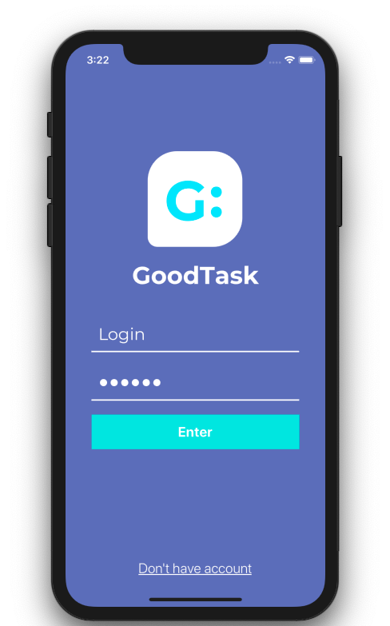
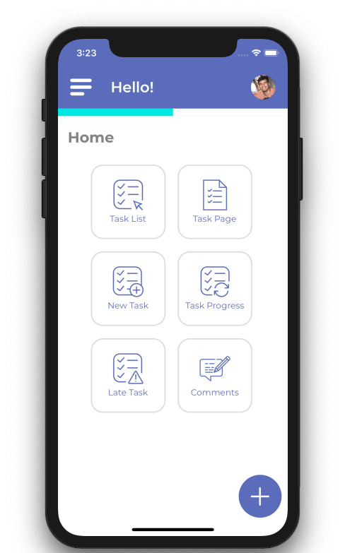
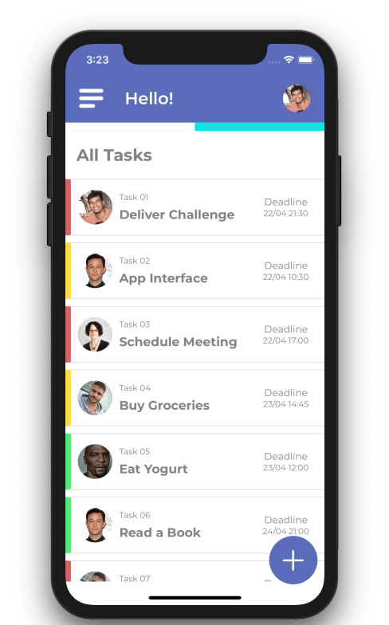
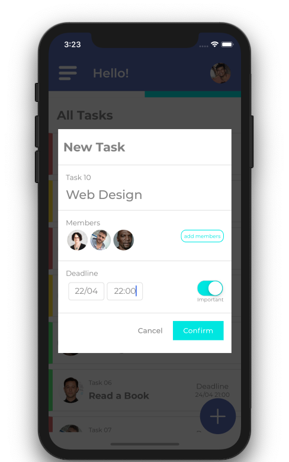

# ToDoListUI
A React Native UI Challenge

----------

## Screenshots  

### 1 - Login  

### 2 - Home  

### 3 - Tasks  

### 4 - Add New Task  



## How to run this project

### 1. Download or Clone this repository  
### 2. Install dependencies  
Run on terminal
```
npm install
```
or
```
yarn install
```

### 3. Run the project  
#### Android  
```
react-native run-android
```
#### iOS  
```
react-native run-ios
```
### External libraries used in this project  
- [react-navigation]([https://link](https://github.com/react-navigation/react-navigation))
- [react-native-modal](https://github.com/react-native-community/react-native-modal)
- [react-native-vector-icons](https://github.com/oblador/react-native-vector-icons)
- [react-native-svg-transformer](https://github.com/kristerkari/react-native-svg-transformer)

### License  
- MIT LICENSE
